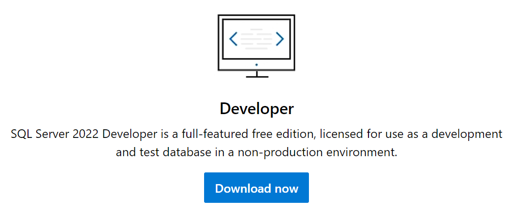
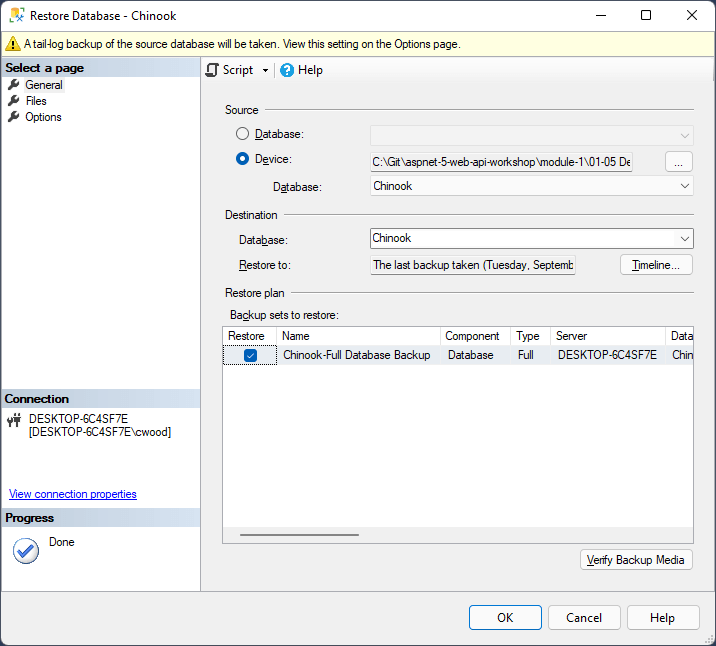

# Installing and Setting Up SQL Server 2022

Go to the <a href="https://www.microsoft.com/en-us/sql-server/sql-server-downloads" target="_blank">Try SQL Server 2022</a> page and download the Developer version. Install locally.

# Creating the Chinook database in MSSQL 2022

Get the <a href="https://github.com/cwoodruff/aspnet-7-web-api-workshop/blob/main/module-1/01-05%20Developing%20Data%20Access%20for%20your%20Web%20API/database/Chinook.bak" target="_blank">Chinook database</a> for this workshop in the GitHub repo. The file is a BAK backup so we will restore it to where you have MSSQL 2022 installed.

It contains all data for the workshop and will be the starting point for the learning.

Use SQL Server Management Studio to restore the database. 

